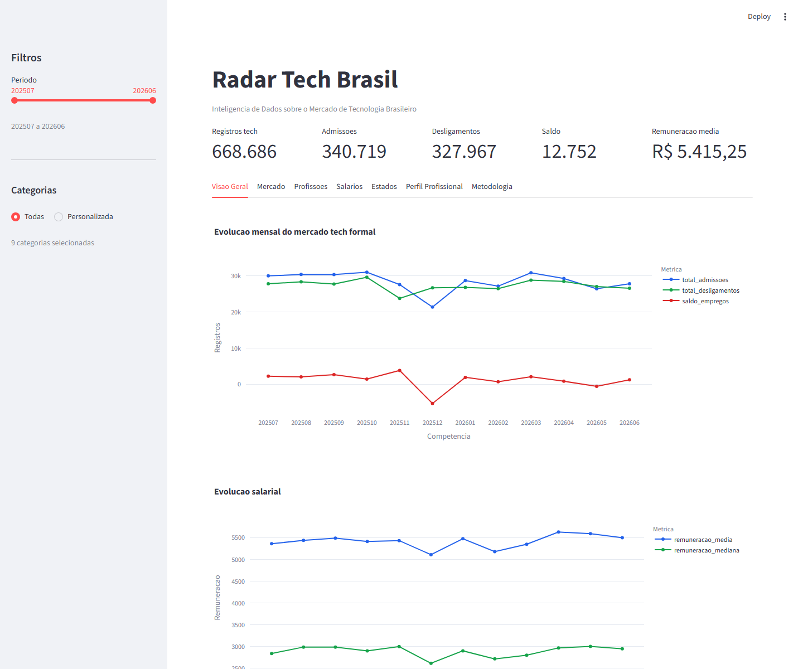

# Radar Tech Brasil

<p align="center">
  <a href="https://github.com/Wwerneck/Radar-Tech-Brasil/actions/workflows/tests.yml"></a>
  <a href="./CHANGELOG.md"></a>
</p>

Inteligência de dados sobre o mercado formal de tecnologia no Brasil, construída com microdados públicos do Novo CAGED e a Classificação Brasileira de Ocupações (CBO).



## Avaliação rápida

- **Problema resolvido:** transforma microdados públicos do Novo CAGED em informação acionável sobre o mercado formal de tecnologia.
- **Evidência visual:** o dashboard acima consolida filtros, mapas, séries temporais, salários e insights.
- **Qualidade:** 19 testes automatizados e CI executado a cada push ou pull request.
- **Como testar localmente:** instale as dependências e execute `streamlit run dashboard/app.py`.

## Sobre o Projeto

Dados públicos de mercado de trabalho são ricos, mas chegam em arquivos grandes, com códigos técnicos e estrutura voltada para publicação, não para análise direta. Este projeto transforma esses dados em uma base analítica reproduzível, com pipeline em Python, agregados mensais, documentação técnica, modelagem PostgreSQL e dashboard interativo em Streamlit.

O foco inicial é responder perguntas sobre admissões, desligamentos, saldo de empregos, ocupações, categorias de tecnologia, salários, escolaridade, idade e distribuição geográfica de profissionais de tecnologia no Brasil.

## Resultados Consolidados

Janela analisada:

```text
07/2025 a 06/2026
```

Indicadores gerais:

| Indicador | Valor |
|---|---:|
| Registros tech | 668.686 |
| Admissões tech | 340.719 |
| Desligamentos tech | 327.967 |
| Saldo tech | 12.752 |
| Ocupações CBO tech | 39 |
| Categorias tech | 9 |

Esses números dependem do mapeamento CBO tech versionado em `data/external/cbo_tech_mapping.csv`.

## Principais Entregas

- Pipeline Python para download, extração, tratamento, enriquecimento e agregação dos dados.
- Mapeamento CBO tech versionado, com critérios explícitos para classificar ocupações de tecnologia.
- Agregados mensais para 12 competências, de `202507` a `202606`.
- Enriquecimento com domínios de UF, região, escolaridade e centróides geográficos.
- Dashboard Streamlit com filtros, mapas, gráficos, tabelas formatadas, downloads CSV e insights automáticos.
- Modelo PostgreSQL com DDL, views e consultas analíticas versionadas.
- Notebook exploratório e documentação de metodologia, fontes, dicionário de dados e status do projeto.
- Testes automatizados cobrindo transformação, agregação, enriquecimento, SQL e manifesto de arquivos.

## Arquitetura

```text
Novo CAGED + CBO
        |
        v
Python ETL
        |
        v
Dados processados
        |
        +--> Agregados CSV enriquecidos
        |        |
        |        v
        |   Streamlit Dashboard
        |
        +--> Modelo PostgreSQL
                 |
                 v
             SQL / Views analíticas
```

## Estrutura do Repositório

```text
data/raw/            arquivos originais locais do Novo CAGED e da CBO
data/processed/      arquivos tratados, agregados e perfis técnicos
data/external/       mapeamentos e tabelas de domínio versionadas
dashboard/           aplicação Streamlit
docs/                documentação técnica e metodológica
notebooks/           análise exploratória em Jupyter
sql/                 DDL, views e consultas analíticas
src/                 código Python do pipeline
tests/               testes automatizados
```

## Tecnologias

- Python
- Pandas
- NumPy
- Plotly
- Streamlit
- SQLAlchemy
- PostgreSQL
- Pytest
- Jupyter

## Como Executar

Crie e ative o ambiente virtual:

```powershell
python -m venv .venv
.\.venv\Scripts\Activate.ps1
pip install -r requirements.txt
```

Configure variáveis locais, se for usar PostgreSQL:

```powershell
Copy-Item .env.example .env
```

O arquivo `.env` não deve ser versionado.

## Pipeline de Dados

Baixar a CBO:

```powershell
python -m src.download_sources --source cbo
```

Baixar uma competência do Novo CAGED:

```powershell
python -m src.download_sources --source caged-mov --year-month 202606
```

Inspecionar um arquivo real:

```powershell
python -m src.inspect_caged --file data/raw/caged/CAGEDMOV202606.txt --rows 1000
```

Executar a janela inicial de 12 meses:

```powershell
python -m src.pipeline_multi
python -m src.consolidate_aggregates --input-dir data/processed --output-dir data/processed
python -m src.enrich_aggregates
python -m src.generate_insights
```

Também é possível usar arquivos já baixados localmente:

```powershell
python -m src.pipeline_multi --skip-download
```

## Dashboard

Executar localmente:

```powershell
streamlit run dashboard/app.py
```

Ou pelo ambiente virtual:

```powershell
.\.venv\Scripts\streamlit.exe run dashboard/app.py
```

Abas disponíveis:

```text
Visão Geral
Mercado
Profissões
Salários
Estados
Perfil Profissional
Insights
Metodologia
```

Recursos atuais:

- Período exibido em formato brasileiro `MM/AAAA`.
- Filtros por categoria, região, UF, ocupação, idade e escolaridade.
- Cards de contexto com maior e menor saldo mensal, categoria líder e UF com maior volume.
- Gráficos de admissões, desligamentos, saldo e evolução salarial.
- Legenda explicativa para salário médio e salário mediano.
- Tabelas em português, com números formatados e salários em reais.
- Downloads CSV das principais tabelas analíticas.
- Mapa geográfico por UF com volume e saldo de empregos.
- Insights automáticos com leitura descritiva do filtro aplicado.
- Aba de metodologia com fontes, recorte, critérios salariais e limitações.

## PostgreSQL

O projeto já possui modelagem SQL versionada, mas a carga real depende de um servidor PostgreSQL local disponível.

Subir PostgreSQL com Docker, quando Docker estiver instalado:

```powershell
docker compose up -d
```

Validar conexão:

```powershell
python -m src.check_database
```

Carregar dimensões e agregados:

```powershell
python -m src.load
```

Carregar a fato detalhada de uma competência:

```powershell
python -m src.load --load-fact --fact-file data/processed/tech_cagedmov202606.csv
```

Arquivos SQL:

```text
sql/create_tables.sql
sql/views.sql
sql/analysis_queries.sql
```

## Documentação

Principais documentos:

```text
docs/fontes_dados.md
docs/metodologia.md
docs/metodologia_cbo_tech.md
docs/dicionario_dados.md
docs/modelagem_postgresql.md
docs/pipeline_multicompetencia.md
docs/janela_12_meses_tech.md
docs/insights_iniciais.md
docs/dashboard_streamlit.md
docs/status_projeto.md
```

Notebook exploratório:

```text
notebooks/01_exploracao.ipynb
notebooks/01_exploracao_executado.ipynb
```

## Testes

Executar a suíte:

```powershell
pytest
```

Status atual:

```text
19 tests passed
```

## Decisões e Limitações

- O recorte inicial usa Novo CAGED e CBO.
- O mapeamento CBO tech é conservador e versionado.
- A CBO não informa stack, senioridade, modalidade remota ou detalhes modernos da função exercida.
- Salários iguais a zero e salários extremos são marcados por flags.
- As métricas de salário do dashboard consideram salários válidos e usam agregações ponderadas quando necessário.
- RAIS, IBGE, Banco Central e outras bases complementares ficam para versões futuras.
- Domínios marcados como `pendente_layout_oficial` devem ser revisados antes de uso definitivo.

## Próximos Passos

1. Validar domínios pendentes contra o layout oficial do Novo CAGED.
2. Executar a carga real no PostgreSQL quando houver servidor local disponível.
3. Carregar a fato detalhada para as 12 competências processadas.
4. Migrar o dashboard de CSV para views PostgreSQL.
5. Revisar o mapeamento CBO tech com critérios qualitativos adicionais.
6. Atualizar screenshots finais do dashboard após a estabilização visual.
7. Publicar uma demonstração web do dashboard Streamlit quando houver ambiente de hospedagem disponível.
